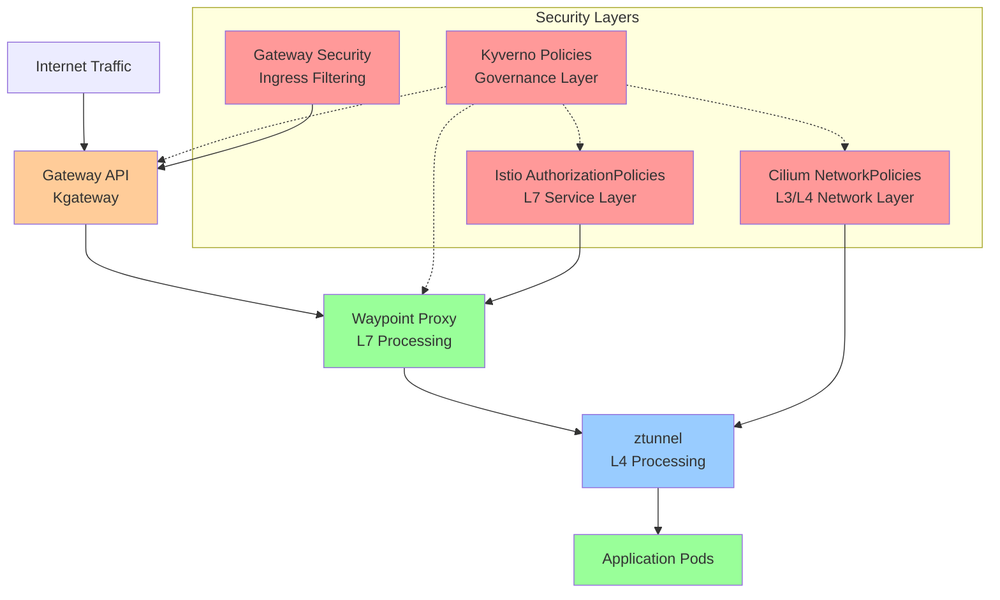
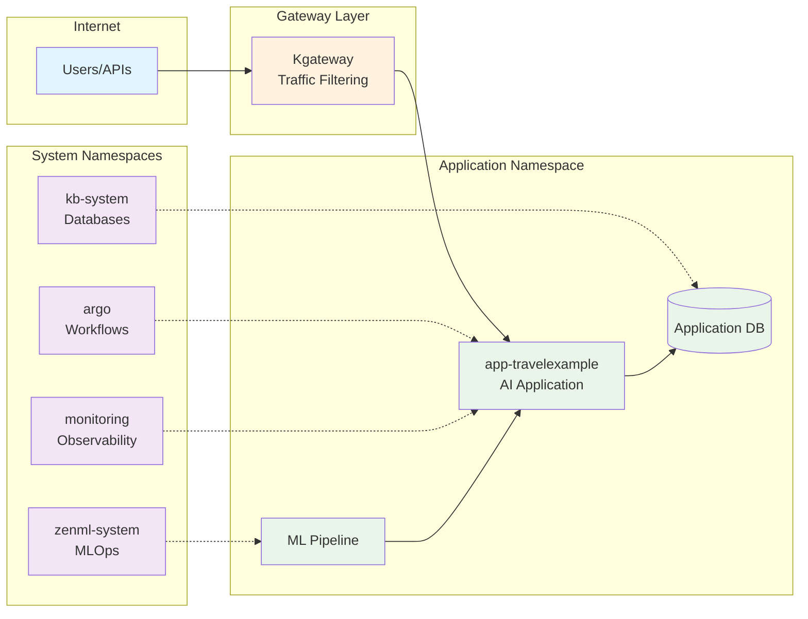

# Zero-Trust Architecture Plan for AI Applications
## Terraform Template with Cilium, Istio Ambient Mesh, Gateway API, and Kyverno

---

## Executive Summary

This architectural plan outlines three approaches for implementing zero-trust networking for AI applications in a Kubernetes cluster using layered security with Cilium CNI, Istio Ambient Mesh, Gateway API (Kgateway), and Kyverno policy engine. The goal is to enable secure multi-tenant AI workloads while maintaining operational flexibility for ZenML MLOps, Argo Workflows, and KubeBlocks database operations.

---

## Current Infrastructure Assessment

### Deployed Components
- **Cilium CNI** (v1.17.5) with Hubble observability and Ambient Mesh compatibility
- **Istio Ambient Mesh** (v1.26.2) via Gloo Operator with ztunnel and waypoint proxies
- **Gateway API** (v1.2.1) with Kgateway (v2.0.3) for ingress traffic management
- **Kyverno** (v1.14.4) policy engine for governance and mutation
- **ZenML MLOps** platform deployed in `zenml-system` namespace (ambient mesh enrolled)
- **Argo Workflows** for CI/CD automation in `argo` namespace
- **KubeBlocks** database operator in `kb-system` namespace
- **Prometheus Operator** monitoring stack in `monitoring` namespace

### Target Application Profile
- **AI Application Namespace**: `app-travelexample`
- **Expected Interactions**:
  - Argo Workflows deploying/managing application resources
  - KubeBlocks provisioning databases within application namespace
  - ZenML executing ML pipelines and accessing application services
  - External ingress via Gateway API for user traffic

---

## Security Architecture Principles

### Defense in Depth Strategy
Our architecture implements multiple security layers following NSA's defense-in-depth model:

1. **Physical Layer**: Cloud provider security (Civo infrastructure)
2. **Network Layer**: Cilium NetworkPolicies (L3/L4) + Istio AuthorizationPolicies (L7)
3. **Service Mesh Layer**: Ambient mesh with ztunnel and waypoint proxies
4. **Gateway Layer**: Kgateway with traffic filtering and routing
5. **Policy Layer**: Kyverno governance and automated policy enforcement
6. **Application Layer**: Workload-specific security configurations

### Zero Trust Principles
- **Never Trust, Always Verify**: All communication requires explicit authorization
- **Least Privilege Access**: Services receive minimum required permissions
- **Microsegmentation**: Network isolation at namespace and service granularity
- **Identity-Based Security**: Cryptographic identity over IP-based rules
- **Continuous Monitoring**: Real-time traffic analysis and policy compliance

---

## Architecture Diagrams

### High-Level Security Layers



### Namespace Communication Flow



---

## Three Architectural Approaches (Ranked)

## 🥇 **APPROACH 1: Graduated Security with Smart Defaults** ⭐ **MOST PREFERRED**

### Architecture Overview
Implements progressive security controls that balance zero-trust principles with operational simplicity. Uses intelligent defaults that can be tightened over time.

### Security Layer Implementation

#### **1. Kyverno Policy Layer (Governance)**
```yaml
# Example: Graduated security enforcement
- name: require-network-policies
  match:
    resources:
      kinds: [Namespace]
  generate:
    kind: CiliumNetworkPolicy
    name: default-deny-ingress
    data:
      spec:
        podSelector: {}
        policyTypes: ["Ingress"]
```

**Responsibilities:**
- Automatic generation of baseline security policies for new namespaces
- Enforcement of security baselines (mTLS, network policies, resource limits)
- Mutation of workloads to add security labels and annotations
- Validation of Istio AuthorizationPolicy compliance

#### **2. Cilium Network Layer (L3/L4)**
**Default Posture**: Namespace-level allow with explicit cross-namespace deny

```yaml
# app-travelexample namespace policy
apiVersion: cilium.io/v2
kind: CiliumNetworkPolicy
metadata:
  name: app-travelexample-base-policy
  namespace: app-travelexample
spec:
  podSelector: {}
  ingress:
  # Allow intra-namespace communication
  - fromEndpoints:
    - matchLabels:
        k8s:io.kubernetes.pod.namespace: app-travelexample
  # Allow system services
  - fromEndpoints:
    - matchLabels:
        k8s:io.kubernetes.pod.namespace: zenml-system
        app: zenml-server
  - fromEndpoints:
    - matchLabels:
        k8s:io.kubernetes.pod.namespace: argo
        app.kubernetes.io/component: workflow-controller
  # Allow database operator
  - fromEndpoints:
    - matchLabels:
        k8s:io.kubernetes.pod.namespace: kb-system
        app.kubernetes.io/name: kubeblocks
  egress:
  # Allow DNS and system communication
  - toEndpoints:
    - matchLabels:
        k8s:io.kubernetes.pod.namespace: kube-system
  - toServices:
    - k8sService:
        serviceName: kube-dns
        namespace: kube-system
```

#### **3. Istio Ambient Mesh Layer (L7)**
**Waypoint Proxy Strategy**: Selective deployment for critical services

```yaml
# Waypoint for app-travelexample
apiVersion: gateway.networking.k8s.io/v1
kind: Gateway
metadata:
  name: app-travelexample-waypoint
  namespace: app-travelexample
  labels:
    istio.io/waypoint-for: service
spec:
  gatewayClassName: istio-waypoint
  listeners:
  - name: mesh
    port: 15008
    protocol: HBONE
---
# Authorization policy for AI application
apiVersion: security.istio.io/v1beta1
kind: AuthorizationPolicy
metadata:
  name: app-travelexample-access
  namespace: app-travelexample
spec:
  targetRefs:
  - kind: Gateway
    name: app-travelexample-waypoint
  rules:
  # Allow ZenML pipeline access
  - from:
    - source:
        principals: ["cluster.local/ns/zenml-system/sa/zenml-server"]
    to:
    - operation:
        methods: ["GET", "POST"]
        paths: ["/api/v1/models/*", "/api/v1/predictions/*"]
  # Allow Argo workflow access
  - from:
    - source:
        principals: ["cluster.local/ns/argo/sa/argo-workflow"]
    to:
    - operation:
        methods: ["GET", "POST", "PUT", "DELETE"]
```

#### **4. Gateway API Layer (Ingress)**
```yaml
# HTTPRoute with security filtering
apiVersion: gateway.networking.k8s.io/v1
kind: HTTPRoute
metadata:
  name: app-travelexample-route
spec:
  parentRefs:
  - name: default-gateway
  hostnames: ["travel.example.com"]
  rules:
  - matches:
    - path:
        type: PathPrefix
        value: "/api/"
    filters:
    - type: RequestHeaderModifier
      requestHeaderModifier:
        add:
        - name: X-Request-Source
          value: external
    backendRefs:
    - name: travel-api
      port: 8080
```

### **Benefits:**
✅ **Operational Simplicity**: Gradual security implementation
✅ **Developer Friendly**: Clear security boundaries without blocking development
✅ **Platform Integration**: Seamless ZenML, Argo, KubeBlocks operations
✅ **Scalability**: Policies scale with namespace growth
✅ **Auditability**: Clear security posture progression

### **Trade-offs:**
⚠️ **Initial Permissiveness**: May allow some unnecessary communication initially
⚠️ **Complexity Growth**: Requires ongoing policy refinement

---

## 🥈 **APPROACH 2: Strict Zero-Trust with Operational Overrides** ⭐ **SECOND PREFERRED**

### Architecture Overview
Implements strict deny-all policies with explicit allow rules. Uses Kyverno to manage operational complexity through automated policy generation.

### Security Layer Implementation

#### **1. Kyverno Policy Layer**
```yaml
# Strict baseline with operational safety nets
- name: strict-zero-trust-baseline
  match:
    resources:
      kinds: [Namespace]
      names: ["app-*"]
  generate:
    kind: CiliumClusterwideNetworkPolicy
    name: "deny-all-{{request.object.metadata.name}}"
    data:
      spec:
        nodeSelector:
          matchLabels:
            k8s:io.kubernetes.pod.namespace: "{{request.object.metadata.name}}"
        ingress: []
        egress:
        # Allow DNS only
        - toEndpoints:
          - matchLabels:
              k8s:io.kubernetes.pod.namespace: kube-system
              k8s-app: kube-dns
```

#### **2. Cilium Network Layer**
**Default Posture**: Deny-all with explicit operational allows

```yaml
# Cluster-wide deny policy
apiVersion: cilium.io/v2
kind: CiliumClusterwideNetworkPolicy
metadata:
  name: default-deny-all
spec:
  nodeSelector: {}
  ingress: []
  egress:
  # Allow essential cluster communication
  - toEntities: ["kube-apiserver"]
  - toEndpoints:
    - matchLabels:
        k8s:io.kubernetes.pod.namespace: kube-system
---
# Explicit allow for platform services
apiVersion: cilium.io/v2
kind: CiliumNetworkPolicy  
metadata:
  name: zenml-to-app-access
  namespace: app-travelexample
spec:
  podSelector: {}
  ingress:
  - fromEndpoints:
    - matchLabels:
        k8s:io.kubernetes.pod.namespace: zenml-system
        app: zenml-server
    toPorts:
    - ports:
      - port: "8080"
        protocol: TCP
      rules:
        http:
        - method: "GET"
          path: "/health"
        - method: "POST"  
          path: "/api/v1/models"
```

#### **3. Istio Ambient Mesh Layer**
**All namespaces enrolled with waypoint proxies**

```yaml
# Mandatory waypoint for all app namespaces
apiVersion: v1
kind: Namespace
metadata:
  name: app-travelexample
  labels:
    istio.io/dataplane-mode: ambient
    istio.io/waypoint: enabled
---
# Strict authorization with operational exceptions
apiVersion: security.istio.io/v1beta1
kind: AuthorizationPolicy
metadata:
  name: default-deny-all
  namespace: app-travelexample
spec:
  # No rules = deny all
---
apiVersion: security.istio.io/v1beta1
kind: AuthorizationPolicy
metadata:
  name: platform-services-access
  namespace: app-travelexample
spec:
  selector:
    matchLabels:
      app: travel-ai-service
  rules:
  - from:
    - source:
        principals: 
        - "cluster.local/ns/zenml-system/sa/zenml-server"
        - "cluster.local/ns/argo/sa/argo-workflow"
    to:
    - operation:
        methods: ["GET", "POST"]
    when:
    - key: request.headers[x-request-source]
      values: ["platform"]
```

### **Benefits:**
✅ **Maximum Security**: True zero-trust implementation
✅ **Compliance Ready**: Meets strictest security requirements  
✅ **Explicit Control**: Every communication path is intentionally configured
✅ **Incident Containment**: Breaches are highly contained

### **Trade-offs:**
⚠️ **Operational Complexity**: Requires extensive policy management
⚠️ **Development Friction**: May slow development workflows
⚠️ **Troubleshooting Difficulty**: Network issues harder to diagnose

---

## 🥉 **APPROACH 3: Service Mesh Centric with Network Policy Backup** ⭐ **LEAST PREFERRED**

### Architecture Overview
Relies primarily on Istio Ambient Mesh for security controls with Cilium as a backup layer. Emphasizes service identity over network segmentation.

### Security Layer Implementation

#### **1. Cilium Network Layer**
**Minimal implementation**: Basic namespace isolation only

```yaml
# Simple namespace-level isolation
apiVersion: cilium.io/v2
kind: CiliumNetworkPolicy
metadata:
  name: namespace-isolation
  namespace: app-travelexample
spec:
  podSelector: {}
  ingress:
  - fromEndpoints:
    - matchLabels:
        k8s:io.kubernetes.pod.namespace: app-travelexample
  # Allow all system namespaces  
  - fromEndpoints:
    - matchLabels:
        k8s:io.kubernetes.pod.namespace: zenml-system
  - fromEndpoints:
    - matchLabels:
        k8s:io.kubernetes.pod.namespace: argo
  - fromEndpoints:
    - matchLabels:
        k8s:io.kubernetes.pod.namespace: kb-system
```

#### **2. Istio Ambient Mesh Layer**
**Primary security enforcement**: Comprehensive L7 policies

```yaml
# All application namespaces enrolled
apiVersion: v1
kind: Namespace
metadata:
  name: app-travelexample
  labels:
    istio.io/dataplane-mode: ambient
---
# Comprehensive authorization policies
apiVersion: security.istio.io/v1beta1
kind: AuthorizationPolicy
metadata:
  name: app-access-control
  namespace: app-travelexample
spec:
  rules:
  - from:
    - source:
        namespaces: ["zenml-system"]
    - source:
        namespaces: ["argo"]
        principals: ["cluster.local/ns/argo/sa/argo-workflow"]
    to:
    - operation:
        methods: ["*"]
  - from:
    - source:
        namespaces: ["kb-system"]
    to:
    - operation:
        methods: ["GET", "POST", "PUT", "DELETE"]
        paths: ["/db/*"]
```

#### **3. Kyverno Policy Layer**
**Focus on mesh policy compliance**

```yaml
# Ensure mesh enrollment
- name: require-ambient-mesh
  match:
    resources:
      kinds: [Namespace]
      names: ["app-*"]
  mutate:
    patchStrategicMerge:
      metadata:
        labels:
          istio.io/dataplane-mode: ambient
```

### **Benefits:**
✅ **Service Identity Focus**: Strong cryptographic identity
✅ **L7 Visibility**: Rich application-layer controls
✅ **Mesh Native**: Leverages service mesh capabilities fully
✅ **Simplified Network Policies**: Less complex L3/L4 rules

### **Trade-offs:**
⚠️ **Single Point of Failure**: Heavy reliance on service mesh
⚠️ **Performance Impact**: All traffic through waypoint proxies
⚠️ **Limited Defense in Depth**: Fewer security layers
⚠️ **Mesh Complexity**: Difficult troubleshooting when mesh issues occur

---

## Implementation Roadmap

### Phase 1: Foundation (Weeks 1-2)
1. **Kyverno Policy Framework**
   - Deploy baseline security policies
   - Implement namespace security standards
   - Create mutation policies for security labels

2. **Cilium Network Policies**  
   - Implement chosen approach network policies
   - Test cross-namespace communication
   - Validate platform service access

### Phase 2: Service Mesh Security (Weeks 3-4)
1. **Ambient Mesh Enrollment**
   - Enroll application namespaces in ambient mesh
   - Deploy waypoint proxies for critical services
   - Implement Istio AuthorizationPolicies

2. **Gateway API Security**
   - Configure ingress traffic filtering
   - Implement rate limiting and DDoS protection
   - Add request validation and transformation

### Phase 3: Integration & Testing (Weeks 5-6)
1. **Platform Integration**
   - Test ZenML ML pipeline execution
   - Validate Argo Workflows deployment
   - Verify KubeBlocks database provisioning

2. **Security Validation**
   - Conduct penetration testing
   - Validate policy enforcement
   - Performance impact assessment

### Phase 4: Monitoring & Refinement (Weeks 7-8)
1. **Observability Setup**
   - Configure security metrics collection
   - Implement policy violation alerting
   - Dashboard creation for security posture

2. **Policy Refinement**
   - Adjust policies based on testing results
   - Optimize performance while maintaining security
   - Document operational procedures

---

## Operational Considerations

### **Monitoring & Observability**
- **Cilium Hubble**: Network flow visibility and policy enforcement monitoring
- **Istio Metrics**: Service mesh communication patterns and authorization decisions  
- **Kyverno Metrics**: Policy compliance and violation tracking
- **Gateway Metrics**: Ingress traffic patterns and security filtering

### **Day 2 Operations**
- **Policy Updates**: Version-controlled policy management through GitOps
- **Troubleshooting**: Layered debugging approach for network connectivity issues
- **Performance Optimization**: Regular review of policy impact on application performance
- **Compliance Reporting**: Automated generation of security posture reports

### **Disaster Recovery**
- **Policy Backup**: Automated backup of all security policies to Git repositories
- **Emergency Access**: Break-glass procedures for emergency system access
- **Rollback Procedures**: Ability to quickly revert security policy changes

---

## Conclusion

**APPROACH 1 (Graduated Security with Smart Defaults)** provides the optimal balance of security, operational simplicity, and platform integration for AI workloads. It enables a progressive security implementation that can evolve with organizational maturity while maintaining the operational flexibility required for ZenML MLOps, Argo Workflows, and KubeBlocks database operations.

The layered defense-in-depth architecture ensures multiple security boundaries while the intelligent defaults reduce operational burden. This approach is most suitable for organizations looking to implement zero-trust principles without disrupting existing development workflows.

---

## Next Steps

1. **Review and approve** the architectural approach
2. **Customize policies** for specific AI application requirements  
3. **Implement Phase 1** foundation components
4. **Establish monitoring** and observability framework
5. **Begin gradual rollout** to production workloads

---

*This architectural plan provides a comprehensive foundation for implementing zero-trust networking in your Kubernetes AI platform. The layered security approach ensures robust protection while maintaining operational flexibility for your MLOps and database platform requirements.*