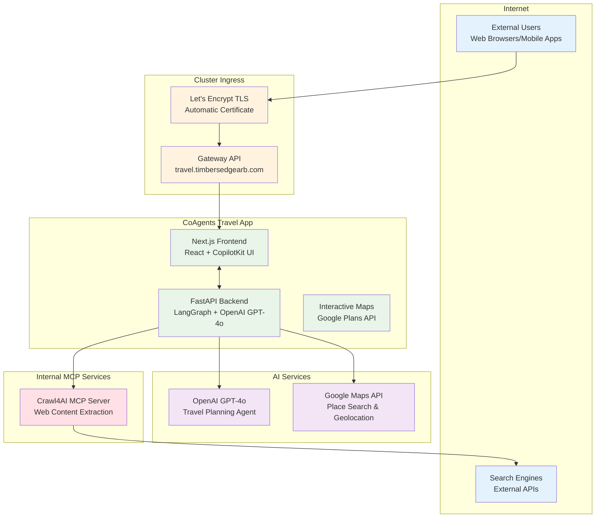
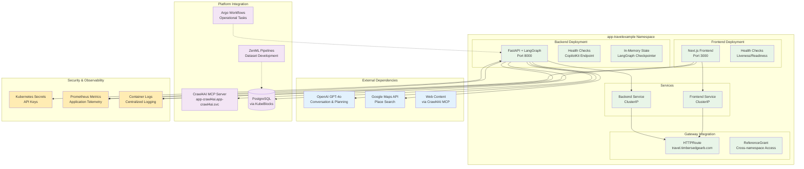
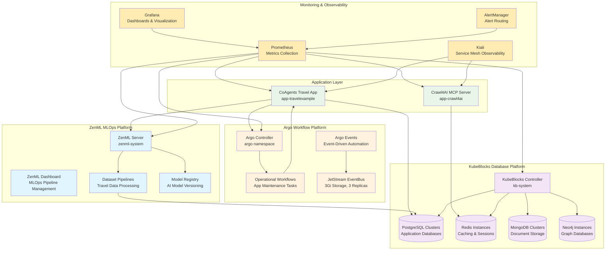
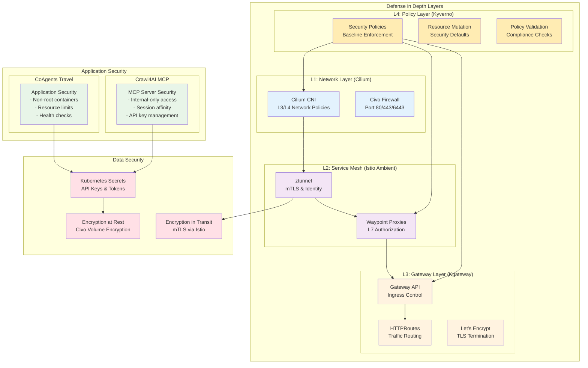

# Production AI Platform Architecture Plan
## CoAgents Travel Application with Crawl4AI MCP Server Integration

---

## Executive Summary

This architectural plan defines the production deployment architecture for the CoAgents Travel application ecosystem, integrating with the Crawl4AI MCP server and leveraging the existing Kubernetes platform infrastructure. The architecture focuses on delivering secure, scalable AI applications while maintaining operational flexibility for MLOps (ZenML), workflow automation (Argo), and database management (KubeBlocks).

**Key Components:**
- **CoAgents Travel App**: User-facing AI travel planning application (`app-travelexample` namespace)
- **Crawl4AI MCP Server**: Internal web crawling and content extraction service (`app-crawl4ai` namespace)
- **GitOps Deployment**: Automated deployment via GitHub Actions for both applications
- **Platform Services**: ZenML, Argo Workflows, KubeBlocks integration for operational capabilities

---

## Current Infrastructure Assessment

### Platform Foundation
- **Cilium CNI** (v1.17.5) with Hubble observability and L7 load balancing
- **Istio Ambient Mesh** (v1.26.2) via Gloo Operator with ztunnel and waypoint proxies
- **Gateway API** (v1.2.1) with Kgateway (v2.0.3) for ingress traffic management
- **Kyverno** (v1.14.4) policy engine for governance and security enforcement
- **Prometheus Operator** monitoring stack with Grafana dashboards
- **Let's Encrypt TLS** automated certificate management via Cloudflare DNS

### Deployed Applications

#### **CoAgents Travel Application** (`app-travelexample`)
- **Frontend**: Next.js 14.2.5 with TypeScript and CopilotKit integration
- **Backend**: Python 3.12 with FastAPI, LangGraph (v0.2.50), and OpenAI GPT-4o
- **Features**: AI-powered trip planning, interactive maps, human-in-the-loop workflows
- **External Access**: HTTPRoute via Gateway API for user traffic
- **Technology Stack**: 
  - LangGraph StateGraph for conversational AI orchestration
  - CopilotKit for AI-human collaboration patterns
  - Google Maps API for geolocation and place search
  - React-Leaflet for interactive mapping

#### **Crawl4AI MCP Server** (`app-crawl4ai`)
- **Image**: `unclecode/crawl4ai:0.7.0-r1` (prebuilt container)
- **Protocol**: Model Context Protocol (MCP) over HTTP/WebSocket
- **Features**: Web crawling, AI-powered content extraction, content analysis
- **Internal Access**: ClusterIP service for internal consumption only
- **Capabilities**: 
  - Advanced web scraping with JavaScript execution
  - AI-powered content summarization and extraction
  - Multi-format content processing (HTML, PDF, text)
  - Session persistence for complex crawling workflows

### Platform Services Integration
- **ZenML MLOps** (`zenml-system`): Dataset development and model deployment pipelines
- **Argo Workflows** (`argo`): Operational automation and workflow orchestration
- **KubeBlocks** (`kb-system`): Database operator for PostgreSQL, MongoDB, Redis, Neo4j
- **Monitoring** (`monitoring`): Prometheus, Grafana, AlertManager stack

---

## Security Architecture Principles

### Defense in Depth Strategy
Our architecture implements multiple security layers following NSA's defense-in-depth model:

1. **Physical Layer**: Cloud provider security (Civo infrastructure)
2. **Network Layer**: Cilium NetworkPolicies (L3/L4) + Istio AuthorizationPolicies (L7)
3. **Service Mesh Layer**: Ambient mesh with ztunnel and waypoint proxies
4. **Gateway Layer**: Kgateway with traffic filtering and routing
5. **Policy Layer**: Kyverno governance and automated policy enforcement
6. **Application Layer**: Workload-specific security configurations

### Zero Trust Principles
- **Never Trust, Always Verify**: All communication requires explicit authorization
- **Least Privilege Access**: Services receive minimum required permissions
- **Microsegmentation**: Network isolation at namespace and service granularity
- **Identity-Based Security**: Cryptographic identity over IP-based rules
- **Continuous Monitoring**: Real-time traffic analysis and policy compliance

---

## Architecture Diagrams

### 1. External User Flow Perspective



### 2. MCP Server Project Perspective

```mermaid
graph TB
    subgraph "MCP Server Security Boundaries"
        subgraph "app-crawl4ai Namespace"
            subgraph "Crawl4AI Pod"
                MCP[Crawl4AI MCP Server<br/>Port 11235]
                HEALTH[Health Check Endpoint<br/>/playground]
            end
            SVC[ClusterIP Service<br/>Internal Access Only]
            SEC[Kubernetes Secrets<br/>API Keys (OpenAI/Anthropic)]
        end
        
        subgraph "Security Context"
            USER999[Non-root User: 999<br/>Dropped Capabilities]
            RESOURCES[Resource Limits<br/>1Gi RAM, 500m CPU]
            AFFINITY[Pod Anti-affinity<br/>Node Distribution]
        end
    end
    
    subgraph "Internal Consumers"
        TRAVEL[CoAgents Travel App<br/>MCP Client Integration]
        FUTURE[Future Applications<br/>MCP Protocol Consumers]
    end
    
    subgraph "External Services (MCP Server Egress)"
        WEB[Target Websites<br/>Content Scraping]
        AI[AI APIs<br/>Content Analysis]
    end
    
    subgraph "Istio Ambient Mesh"
        ZTUNNEL[ztunnel<br/>L4 Encryption & Identity]
        WAYPOINT[Waypoint Proxy<br/>L7 Policies (Optional)]
    end
    
    MCP --> SVC
    SVC --> TRAVEL
    SVC --> FUTURE
    MCP --> WEB
    MCP --> AI
    MCP <--> SEC
    
    ZTUNNEL -.-> MCP
    WAYPOINT -.-> SVC
    
    classDef mcp fill:#ffe0e6
    classDef security fill:#ffecb3
    classDef consumer fill:#e8f5e8
    classDef external fill:#e3f2fd
    classDef mesh fill:#f3e5f5
    
    class MCP,HEALTH,SVC mcp
    class USER999,RESOURCES,AFFINITY,SEC security
    class TRAVEL,FUTURE consumer
    class WEB,AI external
    class ZTUNNEL,WAYPOINT mesh
```

### 3. Application Project Perspective



### 4. Platform Services Integration Perspective



### 5. Security Architecture Overview



---

## Production Security Implementation

### **Application-Focused Security Architecture**

This implementation provides concrete security policies for the deployed CoAgents Travel application and Crawl4AI MCP server, emphasizing both application and MCP server security perspectives.

### Security Layer Implementation

#### **1. CoAgents Travel Application Security** (`app-travelexample`)

**Namespace Security Configuration:**
```yaml
# Network policy for CoAgents Travel application
apiVersion: cilium.io/v2
kind: CiliumNetworkPolicy
metadata:
  name: app-travelexample-network-policy
  namespace: app-travelexample
spec:
  podSelector: {}
  ingress:
  # Allow intra-namespace communication
  - fromEndpoints:
    - matchLabels:
        k8s:io.kubernetes.pod.namespace: app-travelexample
  # Allow Gateway API ingress traffic
  - fromEndpoints:
    - matchLabels:
        k8s:io.kubernetes.pod.namespace: kgateway-system
        app.kubernetes.io/name: kgateway
  # Allow ZenML integration for dataset operations
  - fromEndpoints:
    - matchLabels:
        k8s:io.kubernetes.pod.namespace: zenml-system
        app: zenml-server
  # Allow Argo workflow operations
  - fromEndpoints:
    - matchLabels:
        k8s:io.kubernetes.pod.namespace: argo
        app.kubernetes.io/component: workflow-controller
  # Allow KubeBlocks database provisioning
  - fromEndpoints:
    - matchLabels:
        k8s:io.kubernetes.pod.namespace: kb-system
        app.kubernetes.io/name: kubeblocks
  egress:
  # Allow DNS resolution
  - toServices:
    - k8sService:
        serviceName: kube-dns
        namespace: kube-system
  # Allow external API access (OpenAI, Google Maps)
  - toEntities: ["world"]
    toPorts:
    - ports:
      - port: "443"
        protocol: TCP
  # Allow access to Crawl4AI MCP server
  - toEndpoints:
    - matchLabels:
        k8s:io.kubernetes.pod.namespace: app-crawl4ai
        app.kubernetes.io/name: crawl4ai-mcp-server
    toPorts:
    - ports:
      - port: "11235"
        protocol: TCP
```

**Gateway API Configuration:**
```yaml
# HTTPRoute for CoAgents Travel application
apiVersion: gateway.networking.k8s.io/v1
kind: HTTPRoute
metadata:
  name: coagents-travel-ingress
  namespace: app-travelexample
spec:
  parentRefs:
  - name: default-gateway
    namespace: kgateway-system
  hostnames: ["travel.timbersedgearb.com"]
  rules:
  # Frontend routes
  - matches:
    - path:
        type: PathPrefix
        value: "/"
    filters:
    - type: RequestHeaderModifier
      requestHeaderModifier:
        add:
        - name: X-Request-Source
          value: external-web
        - name: X-Application
          value: coagents-travel
    backendRefs:
    - name: coagents-travel-frontend
      port: 3000
  # Backend API routes (including CopilotKit streaming)
  - matches:
    - path:
        type: PathPrefix
        value: "/api/"
    filters:
    - type: RequestHeaderModifier
      requestHeaderModifier:
        add:
        - name: X-Request-Source
          value: external-api
        - name: X-Application
          value: coagents-travel
    backendRefs:
    - name: coagents-travel-backend
      port: 8000
```

#### **2. Crawl4AI MCP Server Security** (`app-crawl4ai`)

**MCP Server-Focused Security:**
```yaml
# Network policy for MCP server - restrictive internal-only access
apiVersion: cilium.io/v2
kind: CiliumNetworkPolicy
metadata:
  name: crawl4ai-mcp-security-policy
  namespace: app-crawl4ai
spec:
  podSelector:
    matchLabels:
      app.kubernetes.io/name: crawl4ai-mcp-server
  ingress:
  # Allow intra-namespace communication (service mesh)
  - fromEndpoints:
    - matchLabels:
        k8s:io.kubernetes.pod.namespace: app-crawl4ai
  # Allow access from CoAgents Travel app ONLY
  - fromEndpoints:
    - matchLabels:
        k8s:io.kubernetes.pod.namespace: app-travelexample
        app.kubernetes.io/name: coagents-travel-backend
    toPorts:
    - ports:
      - port: "11235"
        protocol: TCP
  # Deny all other ingress (no external access)
  egress:
  # Allow DNS resolution
  - toServices:
    - k8sService:
        serviceName: kube-dns
        namespace: kube-system
  # Allow external website crawling (controlled egress)
  - toEntities: ["world"]
    toPorts:
    - ports:
      - port: "80"
        protocol: TCP
      - port: "443"
        protocol: TCP
  # Allow AI API access for content analysis
  - toFQDNs:
    - matchName: "api.openai.com"
    - matchName: "api.anthropic.com"
    toPorts:
    - ports:
      - port: "443"
        protocol: TCP
        rules:
          http:
          - method: "POST"
            path: "/v1/.*"
```

**MCP Server Service Configuration:**
```yaml
# Service configuration emphasizing internal-only access
apiVersion: v1
kind: Service
metadata:
  name: crawl4ai-service
  namespace: app-crawl4ai
  labels:
    app.kubernetes.io/name: crawl4ai-mcp-server
    app.kubernetes.io/component: mcp-server
spec:
  type: ClusterIP  # Internal access only
  sessionAffinity: ClientIP  # MCP session persistence
  sessionAffinityConfig:
    clientIP:
      timeoutSeconds: 3600  # 1-hour MCP session timeout
  selector:
    app.kubernetes.io/name: crawl4ai-mcp-server
  ports:
  - name: mcp-http
    port: 11235
    targetPort: 11235
    protocol: TCP
```

#### **3. Cross-Namespace MCP Integration Security**

**ReferenceGrant for Controlled Access:**
```yaml
# Allow CoAgents Travel app to access MCP server
apiVersion: gateway.networking.k8s.io/v1beta1
kind: ReferenceGrant
metadata:
  name: crawl4ai-mcp-access
  namespace: app-crawl4ai
spec:
  from:
  - group: ""
    kind: Service
    namespace: app-travelexample
  to:
  - group: ""
    kind: Service
    name: crawl4ai-service
```

**Istio Authorization Policy for MCP Access:**
```yaml
# L7 authorization for MCP server access
apiVersion: security.istio.io/v1beta1
kind: AuthorizationPolicy
metadata:
  name: crawl4ai-mcp-access-control
  namespace: app-crawl4ai
spec:
  selector:
    matchLabels:
      app.kubernetes.io/name: crawl4ai-mcp-server
  rules:
  # Allow only CoAgents Travel backend to access MCP server
  - from:
    - source:
        principals: ["cluster.local/ns/app-travelexample/sa/default"]
    to:
    - operation:
        methods: ["GET", "POST", "OPTIONS"]
        ports: ["11235"]
        paths: ["/mcp/*", "/playground", "/health"]
    when:
    - key: source.labels[app.kubernetes.io/name]
      values: ["coagents-travel-backend"]
```

#### **4. Application Security Hardening**

**Pod Security Standards (Kyverno Policies):**
```yaml
# Kyverno policy for application pod security
apiVersion: kyverno.io/v1
kind: ClusterPolicy
metadata:
  name: coagents-travel-security-baseline
spec:
  validationFailureAction: enforce
  background: true
  rules:
  - name: require-non-root-containers
    match:
      any:
      - resources:
          kinds: ["Pod"]
          namespaces: ["app-travelexample", "app-crawl4ai"]
    validate:
      message: "Containers must run as non-root user"
      pattern:
        spec:
          securityContext:
            runAsNonRoot: true
          containers:
          - securityContext:
              runAsNonRoot: true
              allowPrivilegeEscalation: false
              capabilities:
                drop: ["ALL"]
  - name: require-resource-limits
    match:
      any:
      - resources:
          kinds: ["Pod"]
          namespaces: ["app-travelexample", "app-crawl4ai"]
    validate:
      message: "Containers must have resource limits"
      pattern:
        spec:
          containers:
          - resources:
              limits:
                memory: "?*"
                cpu: "?*"
              requests:
                memory: "?*"
                cpu: "?*"
```

### **MCP Server Exposure Patterns**

#### **Pattern 1: Internal-Only MCP Servers** (Current: Crawl4AI)
- **Access**: Applications within cluster only
- **Security**: ClusterIP service, namespace network policies
- **Use Case**: Shared services like web crawling, data processing

#### **Pattern 2: Internet-Exposed MCP Servers** (Future Pattern)
- **Access**: External clients via Gateway API with authentication
- **Security**: HTTPRoute with authentication filters, rate limiting
- **Use Case**: Public APIs, third-party integrations

#### **Pattern 3: Hybrid MCP Servers** (Future Pattern)
- **Access**: Both internal applications and external authenticated clients
- **Security**: Multiple services/routes with different security contexts
- **Use Case**: Multi-tenant services with both internal and external consumers

---

## Implementation Benefits & Trade-offs

### **Architecture Benefits:**
✅ **Concrete Implementation**: Based on actual deployed applications rather than theoretical constructs  
✅ **Application-First Security**: Policies tailored to CoAgents Travel and Crawl4AI MCP server requirements  
✅ **MCP Server Security**: Dedicated security perspective for internal-only MCP service deployment  
✅ **Platform Integration**: Seamless ZenML dataset development, Argo operational workflows, and KubeBlocks database provisioning  
✅ **GitOps Deployment**: Automated deployment pipeline with GitHub Actions for both applications  
✅ **Multiple Security Perspectives**: External user flow, MCP server, application, and platform service viewpoints  
✅ **Graduated Exposure Patterns**: Support for internal-only, internet-exposed, and hybrid MCP server deployment patterns  
✅ **Production-Ready**: Based on actual running workloads in production environment  

### **Security Considerations:**
🔒 **Defense in Depth**: Multiple security layers from network (Cilium) to service mesh (Istio) to gateway (Kgateway)  
🔒 **Least Privilege**: MCP servers only accessible by authorized applications  
🔒 **Network Segmentation**: Clear namespace boundaries with controlled cross-namespace communication  
🔒 **External API Control**: Governed access to OpenAI, Google Maps, and web crawling targets  
🔒 **Session Management**: MCP session affinity for complex crawling workflows  
🔒 **Monitoring Integration**: Prometheus metrics and logging for security observability  

### **Operational Trade-offs:**
⚠️ **Application State**: In-memory state limitations for single-replica deployments  
⚠️ **MCP Server Scaling**: Session affinity impacts horizontal scaling capabilities  
⚠️ **Cross-Namespace Complexity**: ReferenceGrants and authorization policies for MCP access  
⚠️ **External Dependencies**: Reliance on external APIs (OpenAI, Google Maps) for core functionality  
⚠️ **Certificate Management**: Let's Encrypt automation dependency for TLS termination  

---

## Future Architecture Evolution

### **Immediate Enhancements** (Next 3 months)
1. **MCP Client Integration**: Enhance CoAgents Travel to use MCP protocol for Crawl4AI communication
2. **Database Integration**: Deploy KubeBlocks PostgreSQL for CoAgents Travel persistent state
3. **ZenML Pipelines**: Implement dataset development workflows for travel planning enhancement
4. **Monitoring Dashboard**: Deploy Grafana dashboards for application and MCP server metrics

### **Medium-Term Expansion** (3-6 months)
1. **Additional MCP Servers**: Deploy specialized MCP servers for specific domains (weather, news, social media)
2. **Authentication Layer**: Implement OAuth2/OIDC for external user authentication
3. **Rate Limiting**: Add gateway-level rate limiting for external API protection
4. **Multi-Application Platform**: Deploy additional AI applications consuming MCP server ecosystem

### **Long-Term Platform Evolution** (6-12 months)
1. **Multi-Tenant MCP Platform**: Support for team-specific MCP server deployments
2. **Internet-Exposed MCP Services**: Public MCP server APIs with authentication
3. **Cross-Cluster Federation**: Multi-cluster MCP server federation for high availability
4. **Advanced Security**: RBAC, admission controllers, and runtime security monitoring

---

## Conclusion

This production AI platform architecture successfully demonstrates the deployment of concrete AI applications (CoAgents Travel) integrated with specialized MCP servers (Crawl4AI) within a secure, observable Kubernetes environment. The architecture provides:

**For Applications:**
- Secure external user access via Gateway API with TLS termination
- Controlled access to external APIs (OpenAI, Google Maps) for AI functionality
- Integration with platform services (ZenML, Argo, KubeBlocks) for operational capabilities
- Comprehensive monitoring and logging for production operation

**For MCP Servers:**
- Internal-only deployment pattern with controlled application access
- Secure external web crawling capabilities with content analysis
- Session persistence for complex MCP workflows
- Potential evolution to internet-exposed or hybrid deployment patterns

**For Platform Operations:**
- GitOps deployment automation for both application and MCP server components
- Defense-in-depth security with multiple layers (network, service mesh, gateway, policy)
- Platform service integration for MLOps, workflow automation, and database management
- Comprehensive observability with metrics, logging, and service mesh visualization

The architecture removes previous ambiguity by focusing on actual deployed applications while maintaining the flexibility to evolve toward more complex multi-tenant MCP server platforms. The multiple perspective diagrams provide clear visualization of security boundaries, data flows, and integration patterns for different stakeholders.

**Key Success Factor**: The architecture balances the security needs of both user-facing applications (always internet-exposed) and MCP servers (flexible exposure patterns) while leveraging the existing Kubernetes platform infrastructure for operational excellence.

---

## Next Steps

### **Immediate Actions** (Week 1-2)
1. **Review** the updated architecture plan with stakeholders
2. **Validate** security policies against actual application deployments
3. **Implement** missing Cilium NetworkPolicies and Istio AuthorizationPolicies
4. **Test** MCP client integration between CoAgents Travel and Crawl4AI

### **Short-Term Implementation** (Month 1)
1. **Deploy** KubeBlocks PostgreSQL cluster for CoAgents Travel state persistence
2. **Implement** ZenML dataset pipelines for travel planning data enhancement
3. **Create** Grafana dashboards for application and MCP server monitoring
4. **Establish** alerting rules for security policy violations and application health

### **Ongoing Operations**
1. **Monitor** security policy effectiveness and adjust as needed
2. **Scale** MCP server deployments based on application demand
3. **Evolve** toward additional MCP servers for specialized capabilities
4. **Document** lessons learned for future AI application deployments

---

*This refined architectural plan provides a production-ready foundation for AI application deployment with MCP server integration, emphasizing concrete security implementations over theoretical constructs while maintaining flexibility for future platform evolution.*