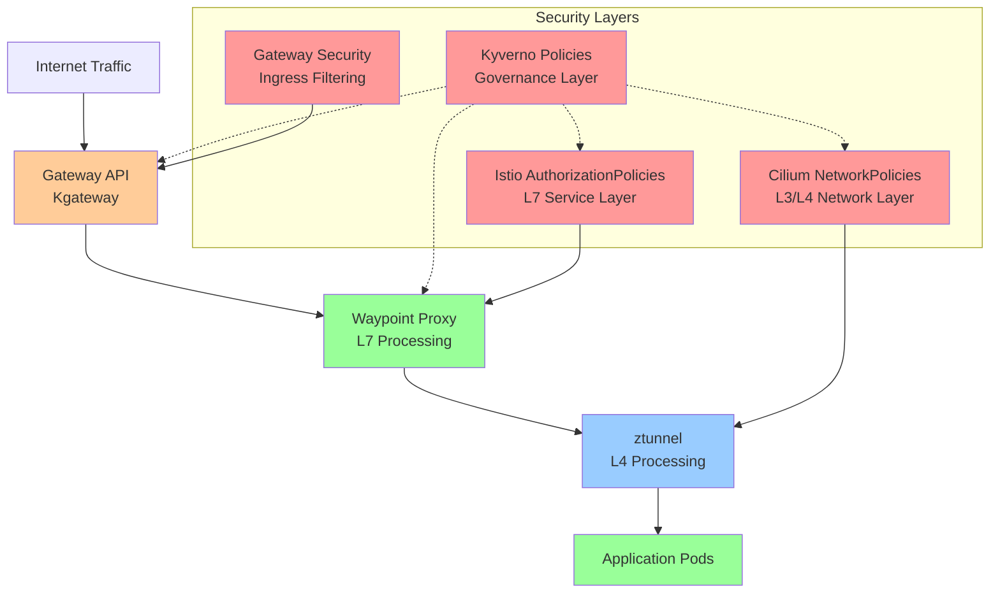
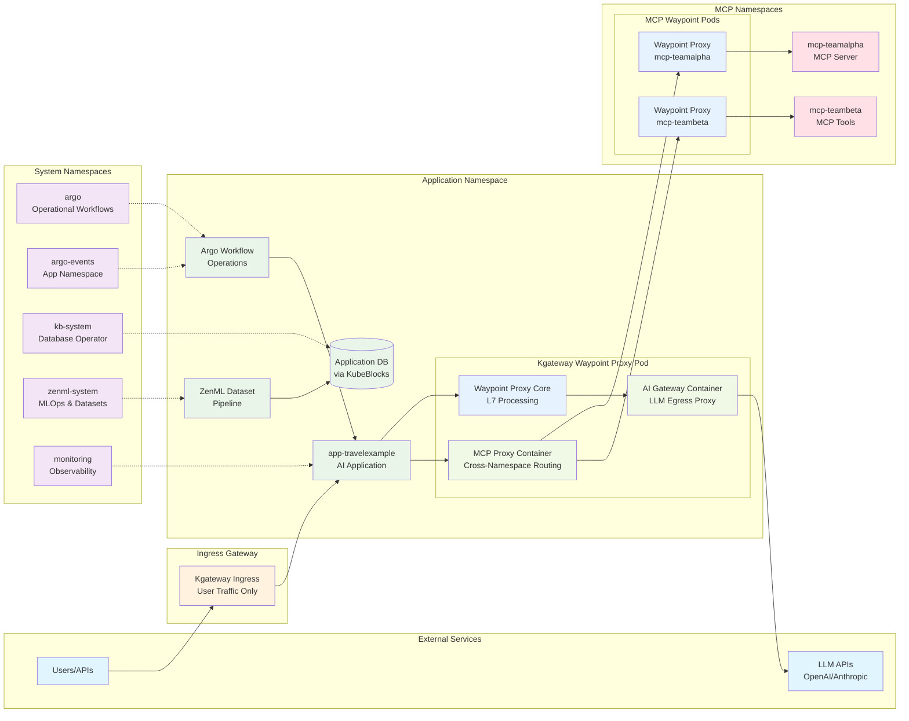

# Zero-Trust Architecture Plan for AI Applications
## Terraform Template with Cilium, Istio Ambient Mesh, Gateway API, and Kyverno

---

## Executive Summary

This architectural plan outlines three approaches for implementing zero-trust networking for AI applications in a Kubernetes cluster using layered security with Cilium CNI, Istio Ambient Mesh, Gateway API (Kgateway), and Kyverno policy engine. The goal is to enable secure multi-tenant AI workloads while maintaining operational flexibility for ZenML MLOps, Argo Workflows, and KubeBlocks database operations.

---

## Current Infrastructure Assessment

### Deployed Components
- **Cilium CNI** (v1.17.5) with Hubble observability and Ambient Mesh compatibility
- **Istio Ambient Mesh** (v1.26.2) via Gloo Operator with ztunnel and waypoint proxies
- **Gateway API** (v1.2.1) with Kgateway (v2.0.3) for ingress traffic management
- **Kyverno** (v1.14.4) policy engine for governance and mutation
- **ZenML MLOps** platform deployed in `zenml-system` namespace (ambient mesh enrolled)
- **Argo Workflows** for CI/CD automation in `argo` namespace
- **KubeBlocks** database operator in `kb-system` namespace
- **Prometheus Operator** monitoring stack in `monitoring` namespace

### Target Application Profile
- **AI Application Namespace**: `app-travelexample`
- **MCP Server Namespaces**: `mcp-*` (e.g., `mcp-teamalpha`, `mcp-teambeta`)
- **Expected Interactions**:
  - Argo Workflows executing application-specific operational workflows (not CI/CD deployment)
  - Argo Events triggering workflows within application namespace for operational tasks
  - KubeBlocks provisioning application databases within app namespace
  - ZenML developing datasets and deploying to application databases via KubeBlocks
  - AI applications accessing LLMs through Kgateway proxy (no direct external LLM API calls)
  - MCP servers/tools accessed by applications via MCP gateway through Kgateway routing
  - Applications communicating with MCP services via waypoint proxies (no direct namespace-to-namespace networking)
  - External ingress via Gateway API for user traffic

---

## Security Architecture Principles

### Defense in Depth Strategy
Our architecture implements multiple security layers following NSA's defense-in-depth model:

1. **Physical Layer**: Cloud provider security (Civo infrastructure)
2. **Network Layer**: Cilium NetworkPolicies (L3/L4) + Istio AuthorizationPolicies (L7)
3. **Service Mesh Layer**: Ambient mesh with ztunnel and waypoint proxies
4. **Gateway Layer**: Kgateway with traffic filtering and routing
5. **Policy Layer**: Kyverno governance and automated policy enforcement
6. **Application Layer**: Workload-specific security configurations

### Zero Trust Principles
- **Never Trust, Always Verify**: All communication requires explicit authorization
- **Least Privilege Access**: Services receive minimum required permissions
- **Microsegmentation**: Network isolation at namespace and service granularity
- **Identity-Based Security**: Cryptographic identity over IP-based rules
- **Continuous Monitoring**: Real-time traffic analysis and policy compliance

---

## Architecture Diagrams

### High-Level Security Layers



### Namespace Communication Flow



---

## Three Architectural Approaches (Ranked)

## 🥇 **APPROACH 1: Graduated Security with Smart Defaults** ⭐ **MOST PREFERRED**

### Architecture Overview
Implements progressive security controls that balance zero-trust principles with operational simplicity. Uses intelligent defaults that can be tightened over time.

### Security Layer Implementation

#### **1. Kyverno Policy Layer (Governance)**
```yaml
# Example: Graduated security enforcement
- name: require-network-policies
  match:
    resources:
      kinds: [Namespace]
  generate:
    kind: CiliumNetworkPolicy
    name: default-deny-ingress
    data:
      spec:
        podSelector: {}
        policyTypes: ["Ingress"]
```

**Responsibilities:**
- Automatic generation of baseline security policies for new namespaces
- Enforcement of security baselines (mTLS, network policies, resource limits)
- Mutation of workloads to add security labels and annotations
- Validation of Istio AuthorizationPolicy compliance

#### **2. Cilium Network Layer (L3/L4)**
**Default Posture**: Namespace-level allow with explicit cross-namespace deny

```yaml
# app-travelexample namespace policy
apiVersion: cilium.io/v2
kind: CiliumNetworkPolicy
metadata:
  name: app-travelexample-base-policy
  namespace: app-travelexample
spec:
  podSelector: {}
  ingress:
  # Allow intra-namespace communication (includes waypoint proxy)
  - fromEndpoints:
    - matchLabels:
        k8s:io.kubernetes.pod.namespace: app-travelexample
  # Allow ZenML dataset development and deployment
  - fromEndpoints:
    - matchLabels:
        k8s:io.kubernetes.pod.namespace: zenml-system
        app: zenml-server
  # Allow Argo operational workflows (not CI/CD)
  - fromEndpoints:
    - matchLabels:
        k8s:io.kubernetes.pod.namespace: argo
        app.kubernetes.io/component: workflow-controller
  # Allow database operator for app database provisioning
  - fromEndpoints:
    - matchLabels:
        k8s:io.kubernetes.pod.namespace: kb-system
        app.kubernetes.io/name: kubeblocks
  # Allow ingress Gateway traffic (user access only)
  - fromEndpoints:
    - matchLabels:
        k8s:io.kubernetes.pod.namespace: kgateway-system
        app.kubernetes.io/name: kgateway
        gateway-role: ingress
  egress:
  # Allow DNS and system communication
  - toEndpoints:
    - matchLabels:
        k8s:io.kubernetes.pod.namespace: kube-system
  - toServices:
    - k8sService:
        serviceName: kube-dns
        namespace: kube-system
  # Allow egress to external LLM APIs via waypoint AI Gateway container
  - toEntities: ["world"]
    toPorts:
    - ports:
      - port: "443"
        protocol: TCP
      rules:
        http:
        - method: "POST"
          path: "/v1/chat/completions"  # OpenAI API
        - method: "POST" 
          path: "/v1/messages"          # Anthropic API
  # Allow communication to MCP namespace waypoint proxies
  - toEndpoints:
    - matchLabels:
        k8s:io.kubernetes.pod.namespace: mcp-teamalpha
        gateway.networking.k8s.io/gateway-name: mcp-teamalpha-waypoint
  - toEndpoints:
    - matchLabels:
        k8s:io.kubernetes.pod.namespace: mcp-teambeta
        gateway.networking.k8s.io/gateway-name: mcp-teambeta-waypoint
---
# MCP namespace policy template (applied to all mcp-* namespaces)
apiVersion: cilium.io/v2
kind: CiliumNetworkPolicy
metadata:
  name: mcp-namespace-base-policy
  namespace: mcp-teamalpha
spec:
  podSelector: {}
  ingress:
  # Allow intra-namespace communication (includes waypoint proxy)
  - fromEndpoints:
    - matchLabels:
        k8s:io.kubernetes.pod.namespace: mcp-teamalpha
  # Allow access from application namespace waypoint MCP proxy containers
  - fromEndpoints:
    - matchLabels:
        k8s:io.kubernetes.pod.namespace: app-travelexample
        gateway.networking.k8s.io/gateway-name: app-travelexample-waypoint
  egress:
  # Allow DNS
  - toServices:
    - k8sService:
        serviceName: kube-dns
        namespace: kube-system
  # Deny all other egress (MCP servers should be self-contained tools)
```

#### **3. Istio Ambient Mesh Layer (L7)**
**Waypoint Proxy Strategy**: Selective deployment for critical services

```yaml
# Kgateway waypoint for app-travelexample with AI and MCP extensions
apiVersion: gateway.networking.k8s.io/v1
kind: Gateway
metadata:
  name: app-travelexample-waypoint
  namespace: app-travelexample
  labels:
    istio.io/waypoint-for: service
  annotations:
    kgateway.io/ai-gateway-enabled: "true"
    kgateway.io/mcp-proxy-enabled: "true"
spec:
  gatewayClassName: kgateway-waypoint
  listeners:
  - name: mesh
    port: 15008
    protocol: HBONE
---
# AI Gateway configuration for LLM egress
apiVersion: gateway.solo.io/v1
kind: Gateway
metadata:
  name: ai-gateway-config
  namespace: app-travelexample
spec:
  bindAddress: "::"
  bindPort: 8080
  proxyNames:
  - app-travelexample-waypoint
  httpGateway:
    virtualServices:
    - name: llm-egress
      domains:
      - "api.openai.com"
      - "api.anthropic.com"
      routes:
      - matchers:
        - prefix: "/v1/"
        routeAction:
          single:
            upstream:
              name: external-llm-apis
              namespace: app-travelexample
        options:
          timeout: 30s
          retryPolicy:
            retryOn: "5xx"
            numRetries: 3
---
# MCP Proxy configuration for cross-namespace routing
apiVersion: mcp.kgateway.io/v1
kind: MCPProxy
metadata:
  name: mcp-proxy-config
  namespace: app-travelexample
spec:
  routes:
  - name: team-alpha-tools
    match:
      prefix: "/mcp/teamalpha/"
    destination:
      namespace: mcp-teamalpha
      service: mcp-server
      port: 8080
  - name: team-beta-tools
    match:
      prefix: "/mcp/teambeta/"
    destination:
      namespace: mcp-teambeta
      service: mcp-server
      port: 8080
---
# Authorization policy for AI application waypoint
apiVersion: security.istio.io/v1beta1
kind: AuthorizationPolicy
metadata:
  name: app-travelexample-waypoint-access
  namespace: app-travelexample
spec:
  targetRefs:
  - kind: Gateway
    name: app-travelexample-waypoint
  rules:
  # Allow ZenML dataset development and deployment
  - from:
    - source:
        principals: ["cluster.local/ns/zenml-system/sa/zenml-server"]
    to:
    - operation:
        methods: ["GET", "POST", "PUT"]
        paths: ["/api/v1/datasets/*", "/api/v1/models/*", "/database/*"]
  # Allow Argo operational workflows (not CI/CD)
  - from:
    - source:
        principals: ["cluster.local/ns/argo/sa/argo-workflow"]
    to:
    - operation:
        methods: ["GET", "POST", "PUT", "DELETE"]
        paths: ["/operations/*", "/workflows/*"]
    when:
    - key: request.headers[x-workflow-type]
      values: ["operational"]
  # Allow internal app access to MCP proxy and AI gateway
  - from:
    - source:
        principals: ["cluster.local/ns/app-travelexample/sa/default"]
    to:
    - operation:
        methods: ["GET", "POST"]
        paths: ["/mcp/*", "/ai-gateway/*"]
---
# MCP namespace kgateway waypoint
apiVersion: gateway.networking.k8s.io/v1
kind: Gateway
metadata:
  name: mcp-teamalpha-waypoint
  namespace: mcp-teamalpha
  labels:
    istio.io/waypoint-for: service
spec:
  gatewayClassName: kgateway-waypoint
  listeners:
  - name: mesh
    port: 15008
    protocol: HBONE
---
# Authorization policy for MCP namespace
apiVersion: security.istio.io/v1beta1
kind: AuthorizationPolicy
metadata:
  name: mcp-waypoint-access
  namespace: mcp-teamalpha
spec:
  targetRefs:
  - kind: Gateway
    name: mcp-teamalpha-waypoint
  rules:
  # Only allow access from application namespace waypoint MCP proxy
  - from:
    - source:
        principals: ["cluster.local/ns/app-travelexample/sa/default"]
    to:
    - operation:
        methods: ["GET", "POST"]
        paths: ["/mcp-services/*"]
    when:
    - key: request.headers[x-mcp-proxy]
      values: ["app-travelexample-waypoint"]
```

#### **4. Gateway API Layer (Ingress - User Traffic Only)**
```yaml
# HTTPRoute for external user traffic only (no LLM/MCP routing)
apiVersion: gateway.networking.k8s.io/v1
kind: HTTPRoute
metadata:  
  name: app-travelexample-ingress
spec:
  parentRefs:
  - name: default-gateway
    namespace: kgateway-system
  hostnames: ["travel.example.com"]
  rules:
  # Application API routes for external users
  - matches:
    - path:
        type: PathPrefix
        value: "/api/"
    filters:
    - type: RequestHeaderModifier
      requestHeaderModifier:
        add:
        - name: X-Request-Source
          value: external
        - name: X-Gateway-Type
          value: ingress
    backendRefs:
    - name: travel-api
      port: 8080
  # Web UI routes
  - matches:
    - path:
        type: PathPrefix
        value: "/"
    filters:
    - type: RequestHeaderModifier
      requestHeaderModifier:
        add:
        - name: X-Request-Source
          value: external-web
    backendRefs:
    - name: travel-web-ui
      port: 3000
---
# Note: LLM and MCP traffic is NOT routed through ingress gateway
# - LLM egress is handled by AI Gateway container in waypoint proxy
# - MCP cross-namespace communication is handled by MCP Proxy container in waypoint proxy
# - This separation ensures proper security boundaries and traffic isolation
```

### **Benefits:**
✅ **Operational Simplicity**: Gradual security implementation with intelligent defaults
✅ **Developer Friendly**: Clear security boundaries without blocking development workflows
✅ **Platform Integration**: Seamless ZenML dataset development, Argo operational workflows, and KubeBlocks database provisioning
✅ **AI Gateway Security**: Kgateway waypoint AI container enforces controlled LLM egress with retry/timeout policies
✅ **MCP Isolation**: Teams deploy MCP servers with waypoint proxy-mediated access (no direct cross-namespace communication)
✅ **Traffic Separation**: Ingress (user traffic) completely separated from egress (LLM) and east-west (MCP) traffic flows
✅ **Waypoint-Based Architecture**: Leverages Kgateway waypoint proxies for both AI Gateway and MCP Proxy functionality
✅ **Scalability**: Policies and waypoint configurations automatically scale with namespace and team growth
✅ **Auditability**: Comprehensive logging of all LLM egress and MCP cross-namespace communication

### **Trade-offs:**
⚠️ **Initial Permissiveness**: May allow some unnecessary communication initially
⚠️ **Complexity Growth**: Requires ongoing policy refinement as teams and MCP services expand
⚠️ **Waypoint Dependency**: LLM egress and MCP access depends on Kgateway waypoint proxy reliability
⚠️ **Proxy Container Overhead**: AI Gateway and MCP Proxy containers add resource consumption to waypoint pods
⚠️ **Configuration Complexity**: Multiple CRDs required (Gateway, MCPProxy, AI Gateway config) for full functionality

---

## 🥈 **APPROACH 2: Strict Zero-Trust with Operational Overrides** ⭐ **SECOND PREFERRED**

### Architecture Overview
Implements strict deny-all policies with explicit allow rules. Uses Kyverno to manage operational complexity through automated policy generation.

### Security Layer Implementation

#### **1. Kyverno Policy Layer**
```yaml
# Strict baseline with operational safety nets
- name: strict-zero-trust-baseline
  match:
    resources:
      kinds: [Namespace]
      names: ["app-*"]
  generate:
    kind: CiliumClusterwideNetworkPolicy
    name: "deny-all-{{request.object.metadata.name}}"
    data:
      spec:
        nodeSelector:
          matchLabels:
            k8s:io.kubernetes.pod.namespace: "{{request.object.metadata.name}}"
        ingress: []
        egress:
        # Allow DNS only
        - toEndpoints:
          - matchLabels:
              k8s:io.kubernetes.pod.namespace: kube-system
              k8s-app: kube-dns
```

#### **2. Cilium Network Layer**
**Default Posture**: Deny-all with explicit operational allows

```yaml
# Cluster-wide deny policy
apiVersion: cilium.io/v2
kind: CiliumClusterwideNetworkPolicy
metadata:
  name: default-deny-all
spec:
  nodeSelector: {}
  ingress: []
  egress:
  # Allow essential cluster communication
  - toEntities: ["kube-apiserver"]
  - toEndpoints:
    - matchLabels:
        k8s:io.kubernetes.pod.namespace: kube-system
---
# Explicit allow for platform services
apiVersion: cilium.io/v2
kind: CiliumNetworkPolicy  
metadata:
  name: zenml-to-app-access
  namespace: app-travelexample
spec:
  podSelector: {}
  ingress:
  - fromEndpoints:
    - matchLabels:
        k8s:io.kubernetes.pod.namespace: zenml-system
        app: zenml-server
    toPorts:
    - ports:
      - port: "8080"
        protocol: TCP
      rules:
        http:
        - method: "GET"
          path: "/health"
        - method: "POST"  
          path: "/api/v1/models"
```

#### **3. Istio Ambient Mesh Layer**
**All namespaces enrolled with waypoint proxies**

```yaml
# Mandatory waypoint for all app namespaces
apiVersion: v1
kind: Namespace
metadata:
  name: app-travelexample
  labels:
    istio.io/dataplane-mode: ambient
    istio.io/waypoint: enabled
---
# Strict authorization with operational exceptions
apiVersion: security.istio.io/v1beta1
kind: AuthorizationPolicy
metadata:
  name: default-deny-all
  namespace: app-travelexample
spec:
  # No rules = deny all
---
apiVersion: security.istio.io/v1beta1
kind: AuthorizationPolicy
metadata:
  name: platform-services-access
  namespace: app-travelexample
spec:
  selector:
    matchLabels:
      app: travel-ai-service
  rules:
  - from:
    - source:
        principals: 
        - "cluster.local/ns/zenml-system/sa/zenml-server"
        - "cluster.local/ns/argo/sa/argo-workflow"
    to:
    - operation:
        methods: ["GET", "POST"]
    when:
    - key: request.headers[x-request-source]
      values: ["platform"]
```

### **Benefits:**
✅ **Maximum Security**: True zero-trust implementation
✅ **Compliance Ready**: Meets strictest security requirements  
✅ **Explicit Control**: Every communication path is intentionally configured
✅ **Incident Containment**: Breaches are highly contained

### **Trade-offs:**
⚠️ **Operational Complexity**: Requires extensive policy management
⚠️ **Development Friction**: May slow development workflows
⚠️ **Troubleshooting Difficulty**: Network issues harder to diagnose

---

## 🥉 **APPROACH 3: Service Mesh Centric with Network Policy Backup** ⭐ **LEAST PREFERRED**

### Architecture Overview
Relies primarily on Istio Ambient Mesh for security controls with Cilium as a backup layer. Emphasizes service identity over network segmentation.

### Security Layer Implementation

#### **1. Cilium Network Layer**
**Minimal implementation**: Basic namespace isolation only

```yaml
# Simple namespace-level isolation
apiVersion: cilium.io/v2
kind: CiliumNetworkPolicy
metadata:
  name: namespace-isolation
  namespace: app-travelexample
spec:
  podSelector: {}
  ingress:
  - fromEndpoints:
    - matchLabels:
        k8s:io.kubernetes.pod.namespace: app-travelexample
  # Allow all system namespaces  
  - fromEndpoints:
    - matchLabels:
        k8s:io.kubernetes.pod.namespace: zenml-system
  - fromEndpoints:
    - matchLabels:
        k8s:io.kubernetes.pod.namespace: argo
  - fromEndpoints:
    - matchLabels:
        k8s:io.kubernetes.pod.namespace: kb-system
```

#### **2. Istio Ambient Mesh Layer**
**Primary security enforcement**: Comprehensive L7 policies

```yaml
# All application namespaces enrolled
apiVersion: v1
kind: Namespace
metadata:
  name: app-travelexample
  labels:
    istio.io/dataplane-mode: ambient
---
# Comprehensive authorization policies
apiVersion: security.istio.io/v1beta1
kind: AuthorizationPolicy
metadata:
  name: app-access-control
  namespace: app-travelexample
spec:
  rules:
  - from:
    - source:
        namespaces: ["zenml-system"]
    - source:
        namespaces: ["argo"]
        principals: ["cluster.local/ns/argo/sa/argo-workflow"]
    to:
    - operation:
        methods: ["*"]
  - from:
    - source:
        namespaces: ["kb-system"]
    to:
    - operation:
        methods: ["GET", "POST", "PUT", "DELETE"]
        paths: ["/db/*"]
```

#### **3. Kyverno Policy Layer**
**Focus on mesh policy compliance**

```yaml
# Ensure mesh enrollment
- name: require-ambient-mesh
  match:
    resources:
      kinds: [Namespace]
      names: ["app-*"]
  mutate:
    patchStrategicMerge:
      metadata:
        labels:
          istio.io/dataplane-mode: ambient
```

### **Benefits:**
✅ **Service Identity Focus**: Strong cryptographic identity
✅ **L7 Visibility**: Rich application-layer controls
✅ **Mesh Native**: Leverages service mesh capabilities fully
✅ **Simplified Network Policies**: Less complex L3/L4 rules

### **Trade-offs:**
⚠️ **Single Point of Failure**: Heavy reliance on service mesh
⚠️ **Performance Impact**: All traffic through waypoint proxies
⚠️ **Limited Defense in Depth**: Fewer security layers
⚠️ **Mesh Complexity**: Difficult troubleshooting when mesh issues occur

---

## Implementation Roadmap

### Phase 1: Foundation (Weeks 1-2)
1. **Kyverno Policy Framework**
   - Deploy baseline security policies
   - Implement namespace security standards
   - Create mutation policies for security labels

2. **Cilium Network Policies**  
   - Implement chosen approach network policies
   - Test cross-namespace communication
   - Validate platform service access

### Phase 2: Service Mesh Security (Weeks 3-4)
1. **Ambient Mesh Enrollment**
   - Enroll application namespaces in ambient mesh
   - Deploy waypoint proxies for critical services
   - Implement Istio AuthorizationPolicies

2. **Gateway API Security**
   - Configure ingress traffic filtering
   - Implement rate limiting and DDoS protection
   - Add request validation and transformation

### Phase 3: Integration & Testing (Weeks 5-6)
1. **Platform Integration**
   - Test ZenML ML pipeline execution
   - Validate Argo Workflows deployment
   - Verify KubeBlocks database provisioning

2. **Security Validation**
   - Conduct penetration testing
   - Validate policy enforcement
   - Performance impact assessment

### Phase 4: Monitoring & Refinement (Weeks 7-8)
1. **Observability Setup**
   - Configure security metrics collection
   - Implement policy violation alerting
   - Dashboard creation for security posture

2. **Policy Refinement**
   - Adjust policies based on testing results
   - Optimize performance while maintaining security
   - Document operational procedures

---

## Operational Considerations

### **Monitoring & Observability**
- **Cilium Hubble**: Network flow visibility and policy enforcement monitoring
- **Istio Metrics**: Service mesh communication patterns and authorization decisions  
- **Kyverno Metrics**: Policy compliance and violation tracking
- **Gateway Metrics**: Ingress traffic patterns and security filtering

### **Day 2 Operations**
- **Policy Updates**: Version-controlled policy management through GitOps
- **Troubleshooting**: Layered debugging approach for network connectivity issues
- **Performance Optimization**: Regular review of policy impact on application performance
- **Compliance Reporting**: Automated generation of security posture reports

### **Disaster Recovery**
- **Policy Backup**: Automated backup of all security policies to Git repositories
- **Emergency Access**: Break-glass procedures for emergency system access
- **Rollback Procedures**: Ability to quickly revert security policy changes

---

## Conclusion

**APPROACH 1 (Graduated Security with Smart Defaults)** provides the optimal balance of security, operational simplicity, and platform integration for AI workloads with multi-team MCP server deployment. It enables a progressive security implementation that can evolve with organizational maturity while maintaining the operational flexibility required for:

- **ZenML dataset development** and deployment to application databases via KubeBlocks
- **Argo operational workflows** within application namespaces (distinct from CI/CD)
- **Kgateway AI Gateway containers** in waypoint proxies enforcing controlled LLM egress with retry/timeout policies
- **Kgateway MCP Proxy containers** in waypoint proxies enabling secure cross-namespace MCP service communication
- **Complete traffic separation** between ingress (user), egress (LLM), and east-west (MCP) traffic flows
- **Waypoint-based architecture** leveraging Kgateway's AI and MCP extensions for enterprise-grade proxy functionality

The layered defense-in-depth architecture ensures multiple security boundaries while the intelligent waypoint proxy configuration reduces operational burden. This approach is most suitable for organizations building AI platforms where teams deploy MCP servers requiring controlled cross-namespace access, applications need governed LLM egress, and strict traffic separation is mandatory without disrupting development workflows.

**Key Architectural Insight**: By positioning AI Gateway and MCP Proxy as containers within Kgateway waypoint proxies rather than separate services, this approach provides enterprise-grade functionality while maintaining the simplicity of the Istio Ambient Mesh model with enhanced Kgateway capabilities.

---

## Next Steps

1. **Review and approve** the architectural approach
2. **Customize policies** for specific AI application requirements  
3. **Implement Phase 1** foundation components
4. **Establish monitoring** and observability framework
5. **Begin gradual rollout** to production workloads

---

*This architectural plan provides a comprehensive foundation for implementing zero-trust networking in your Kubernetes AI platform. The layered security approach ensures robust protection while maintaining operational flexibility for your MLOps and database platform requirements.*