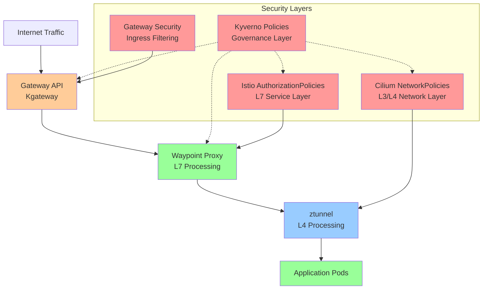
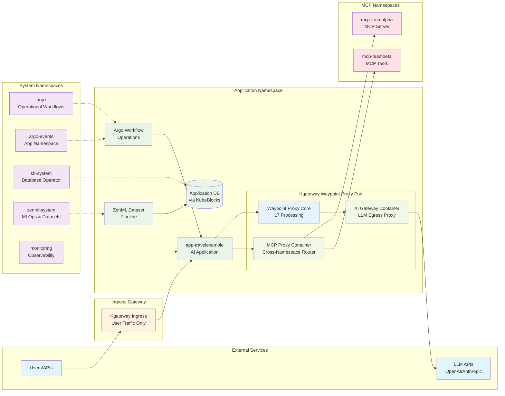

# Zero-Trust Architecture Plan for AI Applications
## Terraform Template with Cilium, Istio Ambient Mesh, Gateway API, and Kyverno

---

## Executive Summary

This architectural plan outlines three approaches for implementing zero-trust networking for AI applications in a Kubernetes cluster using layered security with Cilium CNI, Istio Ambient Mesh, Gateway API (Kgateway), and Kyverno policy engine. The goal is to enable secure multi-tenant AI workloads while maintaining operational flexibility for ZenML MLOps, Argo Workflows, and KubeBlocks database operations.

---

## Current Infrastructure Assessment

### Deployed Components
- **Cilium CNI** (v1.17.5) with Hubble observability and Ambient Mesh compatibility
- **Istio Ambient Mesh** (v1.26.2) via Gloo Operator with ztunnel and waypoint proxies
- **Gateway API** (v1.2.1) with Kgateway (v2.0.3) for ingress traffic management
- **Kyverno** (v1.14.4) policy engine for governance and mutation
- **ZenML MLOps** platform deployed in `zenml-system` namespace (ambient mesh enrolled)
- **Argo Workflows** for CI/CD automation in `argo` namespace
- **KubeBlocks** database operator in `kb-system` namespace
- **Prometheus Operator** monitoring stack in `monitoring` namespace

### Target Application Profile
- **AI Application Namespace**: `app-travelexample`
- **MCP Server Namespaces**: `mcp-*` (e.g., `mcp-teamalpha`, `mcp-teambeta`)
- **Expected Interactions**:
  - Argo Workflows executing application-specific operational workflows (not CI/CD deployment)
  - Argo Events triggering workflows within application namespace for operational tasks
  - KubeBlocks provisioning application databases within app namespace
  - ZenML developing datasets and deploying to application databases via KubeBlocks
  - AI applications accessing LLMs through Kgateway proxy (no direct external LLM API calls)
  - MCP servers/tools accessed by applications via MCP gateway through Kgateway routing
  - Applications communicating with MCP services via waypoint proxies (no direct namespace-to-namespace networking)
  - External ingress via Gateway API for user traffic

---

## Security Architecture Principles

### Defense in Depth Strategy
Our architecture implements multiple security layers following NSA's defense-in-depth model:

1. **Physical Layer**: Cloud provider security (Civo infrastructure)
2. **Network Layer**: Cilium NetworkPolicies (L3/L4) + Istio AuthorizationPolicies (L7)
3. **Service Mesh Layer**: Ambient mesh with ztunnel and waypoint proxies
4. **Gateway Layer**: Kgateway with traffic filtering and routing
5. **Policy Layer**: Kyverno governance and automated policy enforcement
6. **Application Layer**: Workload-specific security configurations

### Zero Trust Principles
- **Never Trust, Always Verify**: All communication requires explicit authorization
- **Least Privilege Access**: Services receive minimum required permissions
- **Microsegmentation**: Network isolation at namespace and service granularity
- **Identity-Based Security**: Cryptographic identity over IP-based rules
- **Continuous Monitoring**: Real-time traffic analysis and policy compliance

---

## Architecture Diagrams

### High-Level Security Layers



### Namespace Communication Flow



---

## Zero-Trust Architecture Implementation

## **Graduated Security with Smart Defaults**

### Architecture Overview
Implements progressive security controls that balance zero-trust principles with operational simplicity. Uses intelligent defaults that can be tightened over time.

### Security Layer Implementation

#### **1. Kyverno Policy Layer (Governance)**
```yaml
# Example: Graduated security enforcement
- name: require-network-policies
  match:
    resources:
      kinds: [Namespace]
  generate:
    kind: CiliumNetworkPolicy
    name: default-deny-ingress
    data:
      spec:
        podSelector: {}
        policyTypes: ["Ingress"]
```

**Responsibilities:**
- Automatic generation of baseline security policies for new namespaces
- Enforcement of security baselines (mTLS, network policies, resource limits)
- Mutation of workloads to add security labels and annotations
- Validation of Istio AuthorizationPolicy compliance

#### **2. Cilium Network Layer (L3/L4)**
**Default Posture**: Namespace-level allow with explicit cross-namespace deny

```yaml
# app-travelexample namespace policy
apiVersion: cilium.io/v2
kind: CiliumNetworkPolicy
metadata:
  name: app-travelexample-base-policy
  namespace: app-travelexample
spec:
  podSelector: {}
  ingress:
  # Allow intra-namespace communication (includes waypoint proxy)
  - fromEndpoints:
    - matchLabels:
        k8s:io.kubernetes.pod.namespace: app-travelexample
  # Allow ZenML dataset development and deployment
  - fromEndpoints:
    - matchLabels:
        k8s:io.kubernetes.pod.namespace: zenml-system
        app: zenml-server
  # Allow Argo operational workflows (not CI/CD)
  - fromEndpoints:
    - matchLabels:
        k8s:io.kubernetes.pod.namespace: argo
        app.kubernetes.io/component: workflow-controller
  # Allow database operator for app database provisioning
  - fromEndpoints:
    - matchLabels:
        k8s:io.kubernetes.pod.namespace: kb-system
        app.kubernetes.io/name: kubeblocks
  # Allow ingress Gateway traffic (user access only)
  - fromEndpoints:
    - matchLabels:
        k8s:io.kubernetes.pod.namespace: kgateway-system
        app.kubernetes.io/name: kgateway
        gateway-role: ingress
  egress:
  # Allow DNS and system communication
  - toEndpoints:
    - matchLabels:
        k8s:io.kubernetes.pod.namespace: kube-system
  - toServices:
    - k8sService:
        serviceName: kube-dns
        namespace: kube-system
  # Allow egress to external LLM APIs via waypoint AI Gateway container
  - toEntities: ["world"]
    toPorts:
    - ports:
      - port: "443"
        protocol: TCP
      rules:
        http:
        - method: "POST"
          path: "/v1/chat/completions"  # OpenAI API
        - method: "POST" 
          path: "/v1/messages"          # Anthropic API
  # Allow direct communication to MCP servers (via MCP Proxy container)
  - toEndpoints:
    - matchLabels:
        k8s:io.kubernetes.pod.namespace: mcp-teamalpha
        app: mcp-server
  - toEndpoints:
    - matchLabels:
        k8s:io.kubernetes.pod.namespace: mcp-teambeta
        app: mcp-server
---
# MCP namespace policy template (applied to all mcp-* namespaces)
apiVersion: cilium.io/v2
kind: CiliumNetworkPolicy
metadata:
  name: mcp-namespace-base-policy
  namespace: mcp-teamalpha
spec:
  podSelector: {}
  ingress:
  # Allow intra-namespace communication (includes waypoint proxy)
  - fromEndpoints:
    - matchLabels:
        k8s:io.kubernetes.pod.namespace: mcp-teamalpha
  # Allow direct access from application namespace MCP proxy container
  - fromEndpoints:
    - matchLabels:
        k8s:io.kubernetes.pod.namespace: app-travelexample
        app.kubernetes.io/component: mcp-proxy
  egress:
  # Allow DNS
  - toServices:
    - k8sService:
        serviceName: kube-dns
        namespace: kube-system
  # Deny all other egress (MCP servers should be self-contained tools)
```

#### **3. Istio Ambient Mesh Layer (L7)**
**Waypoint Proxy Strategy**: Selective deployment for critical services

```yaml
# Kgateway waypoint for app-travelexample with AI and MCP extensions
apiVersion: gateway.networking.k8s.io/v1
kind: Gateway
metadata:
  name: app-travelexample-waypoint
  namespace: app-travelexample
  labels:
    istio.io/waypoint-for: service
  annotations:
    kgateway.io/ai-gateway-enabled: "true"
    kgateway.io/mcp-proxy-enabled: "true"
spec:
  gatewayClassName: kgateway-waypoint
  listeners:
  - name: proxy
    port: 15088
    protocol: istio.io/PROXY
---
# AI Gateway configuration using Gateway API Inference Extension
apiVersion: inference.networking.x-k8s.io/v1alpha2
kind: InferenceModel
metadata:
  name: external-llm-proxy
  namespace: app-travelexample
spec:
  modelName: "external-llm-gateway"
  criticality: Critical
  poolRef:
    name: external-llm-pool
  targetModels:
  - name: openai-gpt4
    weight: 70
  - name: anthropic-claude
    weight: 30
---
# External LLM pool for egress routing
apiVersion: inference.networking.x-k8s.io/v1alpha2
kind: InferencePool
metadata:
  name: external-llm-pool
  namespace: app-travelexample
spec:
  targetPortNumber: 443
  selector:
    app: external-llm-proxy
  extensionRef:
    name: external-llm-endpoint-picker
---
# MCP Gateway configuration for cross-namespace routing
apiVersion: gateway.networking.k8s.io/v1
kind: HTTPRoute
metadata:
  name: mcp-cross-namespace-routes
  namespace: app-travelexample
spec:
  parentRefs:
  - name: app-travelexample-waypoint
    port: 8080
  rules:
  # Route to MCP Team Alpha
  - matches:
    - path:
        type: PathPrefix
        value: "/mcp/teamalpha/"
    backendRefs:
    - name: mcp-server
      namespace: mcp-teamalpha
      port: 8080
  # Route to MCP Team Beta  
  - matches:
    - path:
        type: PathPrefix
        value: "/mcp/teambeta/"
    backendRefs:
    - name: mcp-server
      namespace: mcp-teambeta
      port: 8080
---
# ReferenceGrant to allow cross-namespace access
apiVersion: gateway.networking.k8s.io/v1beta1
kind: ReferenceGrant
metadata:
  name: mcp-cross-namespace-access
  namespace: mcp-teamalpha
spec:
  from:
  - group: gateway.networking.k8s.io
    kind: HTTPRoute
    namespace: app-travelexample
  to:
  - group: ""
    kind: Service
    name: mcp-server
---
apiVersion: gateway.networking.k8s.io/v1beta1
kind: ReferenceGrant
metadata:
  name: mcp-cross-namespace-access
  namespace: mcp-teambeta
spec:
  from:
  - group: gateway.networking.k8s.io
    kind: HTTPRoute
    namespace: app-travelexample
  to:
  - group: ""
    kind: Service
    name: mcp-server
---
# Authorization policy for AI application waypoint
apiVersion: security.istio.io/v1beta1
kind: AuthorizationPolicy
metadata:
  name: app-travelexample-waypoint-access
  namespace: app-travelexample
spec:
  targetRefs:
  - kind: Gateway
    name: app-travelexample-waypoint
  rules:
  # Allow ZenML dataset development and deployment
  - from:
    - source:
        principals: ["cluster.local/ns/zenml-system/sa/zenml-server"]
    to:
    - operation:
        methods: ["GET", "POST", "PUT"]
        paths: ["/api/v1/datasets/*", "/api/v1/models/*", "/database/*"]
  # Allow Argo operational workflows (not CI/CD)
  - from:
    - source:
        principals: ["cluster.local/ns/argo/sa/argo-workflow"]
    to:
    - operation:
        methods: ["GET", "POST", "PUT", "DELETE"]
        paths: ["/operations/*", "/workflows/*"]
    when:
    - key: request.headers[x-workflow-type]
      values: ["operational"]
  # Allow internal app access to MCP proxy and AI gateway
  - from:
    - source:
        principals: ["cluster.local/ns/app-travelexample/sa/default"]
    to:
    - operation:
        methods: ["GET", "POST"]
        paths: ["/mcp/*", "/ai-gateway/*"]
---
# Note: MCP namespaces do NOT need waypoint proxies for this architecture
# The MCP Proxy container in the application namespace waypoint handles
# cross-namespace routing directly to MCP servers
```

#### **4. Gateway API Layer (Ingress - User Traffic Only)**
```yaml
# HTTPRoute for external user traffic only (no LLM/MCP routing)
apiVersion: gateway.networking.k8s.io/v1
kind: HTTPRoute
metadata:  
  name: app-travelexample-ingress
spec:
  parentRefs:
  - name: default-gateway
    namespace: kgateway-system
  hostnames: ["travel.example.com"]
  rules:
  # Application API routes for external users
  - matches:
    - path:
        type: PathPrefix
        value: "/api/"
    filters:
    - type: RequestHeaderModifier
      requestHeaderModifier:
        add:
        - name: X-Request-Source
          value: external
        - name: X-Gateway-Type
          value: ingress
    backendRefs:
    - name: travel-api
      port: 8080
  # Web UI routes
  - matches:
    - path:
        type: PathPrefix
        value: "/"
    filters:
    - type: RequestHeaderModifier
      requestHeaderModifier:
        add:
        - name: X-Request-Source
          value: external-web
    backendRefs:
    - name: travel-web-ui
      port: 3000
---
# Note: LLM and MCP traffic is NOT routed through ingress gateway
# - LLM egress is handled by AI Gateway container in waypoint proxy
# - MCP cross-namespace communication is handled by MCP Proxy container in waypoint proxy
# - This separation ensures proper security boundaries and traffic isolation
```

### **Benefits:**
✅ **Operational Simplicity**: Gradual security implementation with intelligent defaults
✅ **Developer Friendly**: Clear security boundaries without blocking development workflows
✅ **Platform Integration**: Seamless ZenML dataset development, Argo operational workflows, and KubeBlocks database provisioning
✅ **AI Gateway Security**: Kgateway waypoint AI container enforces controlled LLM egress with retry/timeout policies
✅ **MCP Isolation**: Teams deploy MCP servers with waypoint proxy-mediated access (no direct cross-namespace communication)
✅ **Traffic Separation**: Ingress (user traffic) completely separated from egress (LLM) and east-west (MCP) traffic flows
✅ **Waypoint-Based Architecture**: Leverages Kgateway waypoint proxies for both AI Gateway and MCP Proxy functionality
✅ **Scalability**: Policies and waypoint configurations automatically scale with namespace and team growth
✅ **Auditability**: Comprehensive logging of all LLM egress and MCP cross-namespace communication

### **Trade-offs:**
⚠️ **Initial Permissiveness**: May allow some unnecessary communication initially
⚠️ **Complexity Growth**: Requires ongoing policy refinement as teams and MCP services expand
⚠️ **Waypoint Dependency**: LLM egress and MCP access depends on Kgateway waypoint proxy reliability
⚠️ **Proxy Container Overhead**: AI Gateway and MCP Proxy containers add resource consumption to waypoint pods
⚠️ **Configuration Complexity**: Multiple CRDs required (Gateway, MCPProxy, AI Gateway config) for full functionality

---

## Conclusion

**Graduated Security with Smart Defaults** provides the optimal balance of security, operational simplicity, and platform integration for AI workloads with multi-team MCP server deployment. It enables a progressive security implementation that can evolve with organizational maturity while maintaining the operational flexibility required for:

- **ZenML dataset development** and deployment to application databases via KubeBlocks
- **Argo operational workflows** within application namespaces (distinct from CI/CD)
- **Kgateway AI Gateway containers** in waypoint proxies enforcing controlled LLM egress with retry/timeout policies
- **Kgateway MCP Proxy containers** in waypoint proxies enabling secure cross-namespace MCP service communication
- **Complete traffic separation** between ingress (user), egress (LLM), and east-west (MCP) traffic flows
- **Waypoint-based architecture** leveraging Kgateway's AI and MCP extensions for enterprise-grade proxy functionality

The layered defense-in-depth architecture ensures multiple security boundaries while the intelligent waypoint proxy configuration reduces operational burden. This approach is most suitable for organizations building AI platforms where teams deploy MCP servers requiring controlled cross-namespace access, applications need governed LLM egress, and strict traffic separation is mandatory without disrupting development workflows.

**Key Architectural Insight**: By positioning AI Gateway and MCP Proxy as containers within Kgateway waypoint proxies rather than separate services, this approach provides enterprise-grade functionality while maintaining the simplicity of the Istio Ambient Mesh model with enhanced Kgateway capabilities.

---

## Next Steps

1. **Review and approve** the architectural approach
2. **Customize policies** for specific AI application requirements  
3. **Deploy foundational components** (Kyverno, Cilium policies, waypoint proxies)
4. **Establish monitoring** and observability framework
5. **Begin gradual rollout** to production workloads

---

*This architectural plan provides a comprehensive foundation for implementing zero-trust networking in your Kubernetes AI platform. The layered security approach ensures robust protection while maintaining operational flexibility for your MLOps and database platform requirements.*